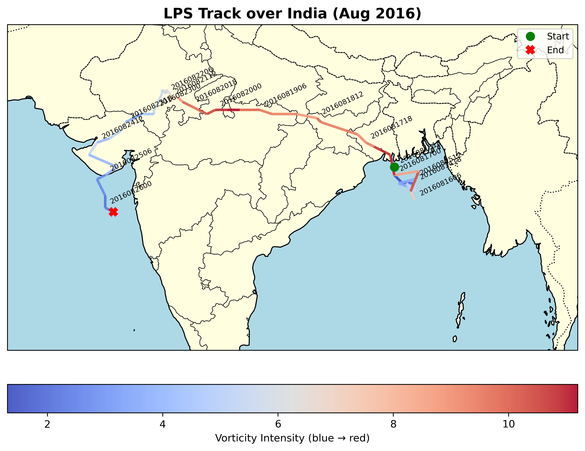
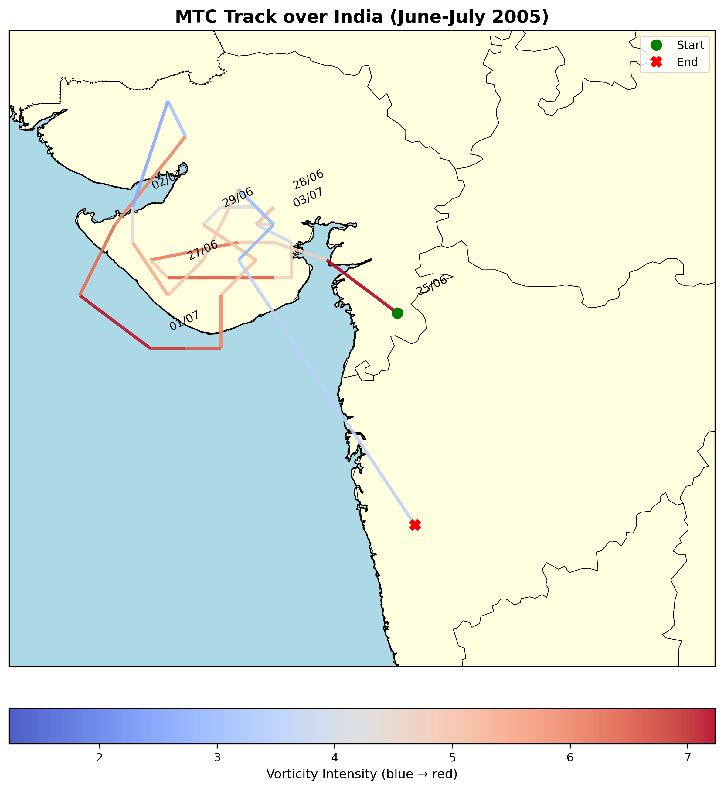

# CYCLONE-TRACKING

This repository contains a robust algorithm for cyclone detection and tracking, originally developed in NCL (NCAR Command Language) for mid-troposphere cyclone analysis. The algorithm is versatile and can be applied to track a wide variety of atmospheric systems, including cyclones, low-pressure systems, and other tropical disturbances, as long as the relevant fields are used where these systems appear as local maxima or minima at a single pressure level.

The method is highly accurate and has been validated against manually tracked cyclone datasets, ensuring reliability for both research and operational applications. Users can apply this algorithm to different meteorological fields such as pressure, geopotential height, or vorticity, depending on the type of system they wish to study.

## Key Features
- Detection and tracking of cyclones and low-pressure systems at multiple atmospheric levels  
- Flexibility to identify systems represented as either maxima or minima in atmospheric fields  
- Validation against manual tracking data for improved accuracy  
- Originally implemented in NCL, with plans to expand the implementation to Python and other programming languages for broader accessibility  
- Easy integration with observational or model datasets  

This tool is intended for researchers and meteorologists who need a reliable and automated method for analyzing cyclones and other dynamic atmospheric systems.
The track data from june-september 1998-2019 can be downloaded from the following link : 
IMPORTENT NOTE CYCLONE OUTPUT FILE : 
This file contains the raw output of an automatic cyclone detection and tracking algorithm (more details : Classification of mid-tropopsheric cyclones over the Arabian Sea and western India https://rmets.onlinelibrary.wiley.com/doi/abs/10.1002/qj.4466) over the region and run over the region (5 to 30 N and 45 to 115 E) using 600 hPa for mid level systems analysis. Only tracks which lasted for 24 hours or 4 track points are stored" \
                 + "The dataset stores cyclone/system track information in a 3D array (TREJ) along with associated properties: " \
                 + "TIME_RECORD (timestamps), LAT_RECORD and LON_RECORD (track positions), DIFF_RECORD (mid-level minus lower-level vorticity), " \
                 + "VOM_RECORD (mid-level vorticity), Q_RECORD (mid-level humidity), PMAX_RECORD (pressure of max vorticity), " \
                 + "TRACK_LENGTH (total time steps), and INDX_RECORD (system index reference). " \
                 + "This is a direct output file contains all detected cyclone tracks duirng tracking, including thousands of very short tracks and dry tracks. " \
                 + "Users must apply appropriate filtering to extract meaningful tracks for scientific use. Examples: " \
                 + "1) Long-lived systems: use TRACK_LENGTH >= 12 (3 days at 6-hourly data). " \
                 + "2) Moist cyclones: filter on Q_RECORD above a chosen threshold. " \
                 + "3) MTC pase or mid-tropospheric vorticity maximum: apply DIFF_RECORD > 0. on a track point" \
                 + "4) LPS phase or lower tropophsere vorticity maximum: apply DIFF_RECORD <= 0  on a track point (with possible relaxation, since many LPS have weak low-level vorticity). " \
                 + "Some systems transition between MTCs and LPSs during their life cycle (see Kushwaha, P., J. Sukhatme, and R. Nanjundiah, 2021: A Global Tropical Survey of Midtropospheric Cyclones. MWR, 149, 2737-2753, https://doi.org/10.1175/MWR-D-20-0222.1). " \
                 + "Researchers are advised to carefully apply thresholds suited to their study objectives. Note that the system track points array has a constant size of 300; however, many real tracks will be significantly shorter than this, so you will see missing values once a track has ended at index track_length - 1. Further note that topographic cyclones need to be removed, as ERA5 does not mask topography data. Hence, centers or tracks intersecting topography should be removed using surface geopotential criteria. However, if your analysis region is below the 600 hPa geopotential height, this step may not be required. For any queries or clarifications, please contact pkushwaha9999@gmail.com.

## Tracking Accuracy

**Example 1:** Track of a Cyclone which formed in the Arabian Sea and was tracked by the tracking algorithm.
The accuracy of the method is demonstrated below for **Cyclone Index = 1/39 (index in subset/full data)**, which corresponds to the June 1998 cyclone.
The tracking algorithm captured a track length of **37 time steps**, starting on **1998-06-01 18:00 UTC** and ending on **1998-06-10 18:00 UTC**, as recorded in the `TIME_RECORD` variable of the tracking algorithm output file. The track has been plotted using `LAT_RECORD` and `LON_RECORD` as x-y coordinates, with `VOM_RECORD` representing the intensity of the cyclone, shown as the color of the track.

**Example 2:** Track of a random low-pressure system (LPS) that formed in the Bay of Bengal and reached the Arabian Sea, precisely tracked by the tracking algorithm.
The accuracy of the method is demonstrated below for **Cyclone Index = 1150/27716(index in subset/full data)**. The tracking algorithm captured a track length of **51 six-hourly time steps**, starting on **2016-08-13 18:00 UTC** and ending on **2016-08-26 06:00 UTC**, as recorded in the `TIME_RECORD` variable of the tracking algorithm output file. The track has been plotted using `LAT_RECORD` and `LON_RECORD` as x-y coordinates, with `VOM_RECORD` representing the intensity of the cyclone, shown as the color of the track.

**Example 3:** Track of a random middle troposhere cyclone (MTC) that formed over Gujarat and remain quasi stationary, precisely tracked by the tracking algorithm.
The accuracy of the method is demonstrated below for **Cyclone Index = 590/11198 (index in subset/full data)**. The tracking algorithm captured a track length of **34 six-hourly time steps**, starting on **2005-06-25 18:00 UTC** and ending on **2005-07-04 00:00 UTC**, as recorded in the `TIME_RECORD` variable of the tracking algorithm output file. The track has been plotted using `LAT_RECORD` and `LON_RECORD` as x-y coordinates, with `VOM_RECORD` representing the intensity of the cyclone, shown as the color of the track.

